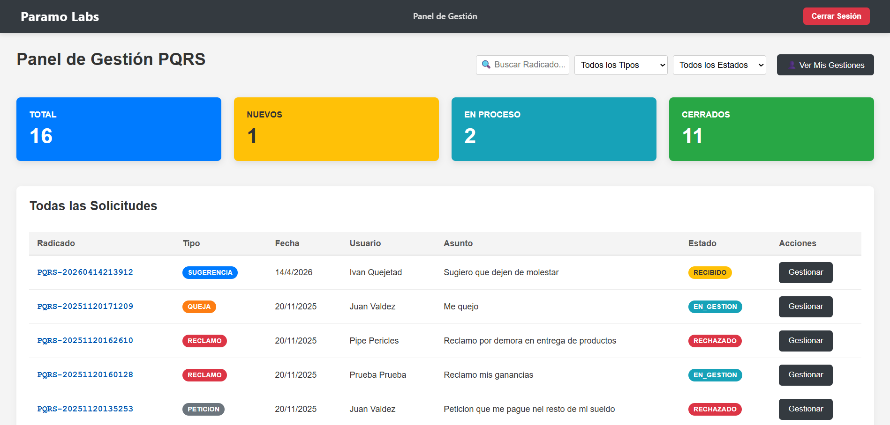

# 📨 PQRS-System (Python & React Version)

### Gestión Avanzada de Peticiones, Quejas, Reclamos y Sugerencias

Un sistema moderno, seguro y desacoplado desarrollado por **Paramo Labs** para ofrecer una experiencia de usuario fluida y un backend escalable, diseñado para optimizar la atención al ciudadano y la gestión interna.

---

## 📸 Vista General del Sistema

Antes de entrar en el código, dale un vistazo a la interfaz final del ecosistema **Paramo Labs**:

### 🖥️ Panel de Gestión Administrativo (Dashboard)
Esta es la vista principal que reciben los funcionarios. Destaca el uso de **React Cards** reactivas para métricas en tiempo real (Total, Nuevos, En Proceso, Cerrados) y una **DataTable** personalizada con filtros avanzados y estados visuales (Badges).


*Imagen 1: Visualización general del estado de las solicitudes y listado interactivo.*

### 📝 Sección Pública: Radicación de Solicitudes
Diseño limpio y enfocado en la UX para el ciudadano. Un formulario responsivo validado con **Pydantic** en el backend para asegurar la integridad de los datos de contacto y la descripción de la solicitud.


*Imagen 2: Interfaz responsiva para que el ciudadano registre su Petición, Queja o Reclamo.*

---

## 🛠️ Stack Tecnológico

### Backend (Python & FastAPI)
* **FastAPI:** Framework de alto rendimiento para la construcción de la API RESTful.
* **SQLAlchemy & PyMySQL:** ORM y conector para la gestión de base de datos MySQL (XAMPP) sin escribir SQL puro.
* **Pydantic:** Validación rigurosa de esquemas de datos y tipado.
* **Seguridad:** Implementación de **JWT (JSON Web Tokens)** mediante `python-jose` y cifrado de contraseñas con `Passlib` (sha256_crypt).
* **Notificaciones:** Gestión de envíos por correo electrónico mediante `Smtplib`.

### Frontend (React & Vite)
* **React 19:** Biblioteca principal para una interfaz de usuario reactiva y moderna.
* **Vite:** Herramienta de construcción ultra rápida para el flujo de desarrollo.
* **React Router Dom:** Gestión de rutas (Públicas y Protegidas para el Dashboard).
* **Axios:** Cliente HTTP configurado con un **Interceptor** para adjuntar automáticamente el token Bearer en cada petición.
* **CSS Vanilla:** Estilos personalizados y ligeros, priorizando el rendimiento sin dependencias pesadas.

---

## ⚡ Flujos Clave de la Aplicación

### 1. Gestión Interna y Trazabilidad (Modal Dinámico)
Implementación de un flujo de trabajo eficiente. Al dar clic en "Gestionar", se abre un **React Modal** que carga asíncronamente los detalles de la PQRS. El funcionario puede responder y cambiar el estado (ej: de RECIBIDO a CERRADO) en un solo paso, disparando notificaciones automáticas.


*Imagen 3: Flujo de gestión interna: detalle de la solicitud y formulario de respuesta integrada.*

### 2. Consulta de Estado y Transparencia
El ciudadano puede consultar el avance de su trámite sin loguearse. Se validó la UX mediante un modal de búsqueda por radicado. Si la PQRS tiene una **Respuesta Oficial**, esta se visualiza en un panel destacado con *feedback* visual verde (`alert-success`).

| Búsqueda por Radicado | Visualización de Respuesta Oficial |
| :---: | :---: |
|  |  |
| *Validación de input para formato PQRS-YYYY...* | *Muestra estado actual y la respuesta final del funcionario.* |

---

## 🚀 Características Principales

* **Interfaz Reactiva:** Experiencia de usuario dinámica y fluida gracias a React 19.
* **Seguridad Robusta:** Autenticación de usuarios basada en tokens y protección de rutas privadas en el frontend.
* **Documentación Interactiva:** API documentada automáticamente con Swagger (disponible en `/docs`).
* **Arquitectura Desacoplada:** Facilita el mantenimiento independiente del Frontend y el Backend.

## 💡 Roadmap de Profesionalización (Próximas Mejoras)

Actualmente, el proyecto se encuentra en una fase de optimización para alcanzar estándares de producción:
1.  **Seguridad de Credenciales:** Migración de claves sensibles (DB y JWT) a archivos de variables de entorno (.env).
2.  **Trazabilidad:** Implementación de una tabla de auditoría para registrar el historial de cambios de estado en las PQRS.
3.  **Validación de Adjuntos:** Restricción de formatos seguros (PDF, JPG, PNG) y límites de tamaño (máx 5MB).
4.  **Optimización de UX:** Incorporación de **Spinners** de carga y notificaciones visuales (Toasts) para feedback en tiempo real.

## ⚙️ Instrucciones para Ejecución Local


### **Instrucciones para Ejecución Local**

1.  **Backend:**
    ```bash
    # Activar entorno virtual e iniciar servidor
    .\venv\Scripts\activate
    python -m uvicorn main:app --reload
    ```
2.  **Frontend:**
    ```bash
    # Instalar dependencias e iniciar modo desarrollo
    npm install
    npm run dev
    ```

---

## 👨‍💻 Autor
**Jose Alarcón** - Founder of **Paramo Labs S.A.S.**
